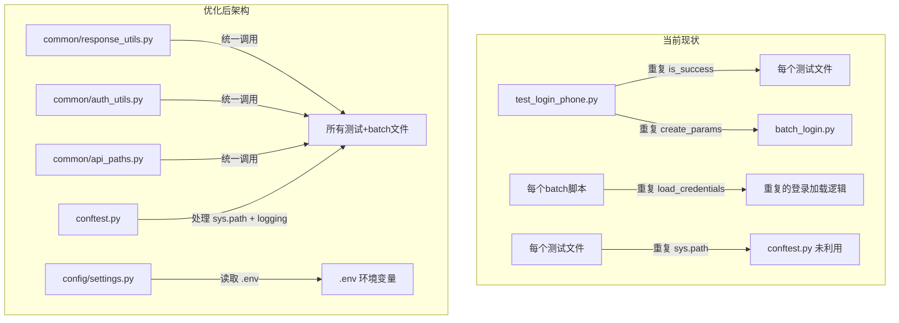

# ApiAutomation 项目分析与优化计划

## 一、项目概况

### 项目定位
基于 pytest 的 API 自动化测试项目，用于测试 EastPoint 直播社交平台的接口，涵盖：用户注册、手机登录、发送金币红包/礼物红包、抢红包、批量送礼物等核心业务流程。

### 技术栈
- **语言**: Python 3
- **测试框架**: pytest + pytest-html
- **HTTP 客户端**: requests
- **加密**: cryptography (AES-CBC + SHA256)
- **并发**: concurrent.futures (ThreadPoolExecutor)

---

## 二、项目结构总览

```
ApiAutomation/
├── common/                          # ❗公共模块
│   ├── __init__.py                  # 空文件
│   ├── excel_utils.py               # ❌ 空文件，无实际内容
│   ├── http_utils.py                # HTTP 请求封装 (GET/POST, 支持 AES 加密)
│   └── sign_utils.py                # 签名生成 + AES-CBC 加密工具
├── config/                          # 配置模块
│   ├── __init__.py
│   └── settings.py                  # 集中配置（URL, Key, Headers 等）
├── data/                            # 测试数据
│   ├── batch_login_credentials.json  # 批量登录凭证（自动生成）
│   ├── device_ids.csv               # 设备 ID 列表
│   ├── login_credentials.json        # 登录凭证缓存（自动生成）
│   ├── login_phone.csv              # 登录手机号列表
│   └── register_phone.csv           # 注册手机号列表
├── tests/                           # pytest 测试用例
│   ├── __init__.py                  # 空文件
│   ├── test_login_phone.py          # 手机登录测试（含凭证管理核心逻辑）
│   ├── test_registered.py           # 注册测试（发验证码+注册）
│   ├── test_red_packet.py           # 发金币红包测试
│   ├── test_receive_red_packet.py   # 抢红包测试（含发+抢串联）
│   ├── test_send_gift.py            # 批量送礼物测试
│   ├── test_gift_red_packet.py      # 发送礼物红包测试
│   └── test_business_from_json.py   # 业务接口示例（占位）
├── batch_*.py                       # 独立批量脚本（共7个）
│   ├── batch_login.py               # 批量登录（多线程）
│   ├── batch_register.py            # 批量注册（多线程）
│   ├── batch_receive_red_packet.py  # 批量抢红包（696行，最大文件）
│   ├── batch_send_coin_red_packet.py
│   ├── batch_send_gift_red_packet.py
│   ├── batch_send_gift.py
│   └── send_100_red_packets.py      # 单人发100个红包
├── conftest.py                      # pytest 插件配置（--run-api 选项）
├── pytest.ini                       # pytest 命令行默认参数
├── requirements.txt
├── .gitignore
├── .github/                         # GitHub Actions 目录（空）
└── README_BATCH_LOGIN.md            # 批量登录使用说明
```

---

## 三、发现的问题与优化建议

### 问题 1：严重的代码重复

#### 1.1 响应成功判断逻辑重复
以下 7 个文件中各自实现了几乎相同的 `is_success()` / `check_response_success()` 函数：
- `test_red_packet.py` (第81-87行, 第143-149行, 第202-208行, 第298-304行)
- `test_send_gift.py` (第91-97行, 第154-160行, 第214-220行, 第313-319行)
- `test_gift_red_packet.py` (第86-92行, 第150-156行, 第211-217行, 第316-322行)
- `test_receive_red_packet.py` (第161-178行)
- `batch_login.py` (第95-125行)
- `batch_register.py` (第102-118行)
- `send_100_red_packets.py` (第50-67行)

**建议**: 抽取为 `common/response_utils.py` 中的统一函数

#### 1.2 登录凭证加载逻辑重复
- `batch_receive_red_packet.py`, `batch_send_coin_red_packet.py`, `batch_send_gift_red_packet.py`, `batch_send_gift.py` 中都重复实现了 `load_login_credentials()` 函数
- 每个文件中还重复了 `build_business_headers()` 函数

**建议**: 抽取为 `common/auth_utils.py` 中的统一函数

#### 1.3 sys.path.insert 重复
几乎所有测试文件和批处理文件开头都有以下代码：
```python
PROJECT_ROOT = Path(__file__).resolve().parents[1]  # 或 .parent
if str(PROJECT_ROOT) not in sys.path:
    sys.path.insert(0, str(PROJECT_ROOT))
```

**建议**: 在 `conftest.py` 中统一处理 `sys.path`，或在项目根目录创建 `setup.py` 以安装模式运行

#### 1.4 测试文件的「直接运行」模式重复
`test_red_packet.py`, `test_send_gift.py`, `test_gift_red_packet.py`, `test_receive_red_packet.py` 每个文件都包含了：
- `parse_args()` 函数
- `__main__` 入口
- `_xxx_direct()` 直接运行函数

这部分代码在每个文件中高度重复（约60-70行/文件）。

**建议**: 抽取为 `cli/` 或 `scripts/` 目录下的独立 CLI 入口

#### 1.5 `create_login_params` 重复
`test_login_phone.py` 和 `batch_login.py` 中有几乎完全相同的 `create_login_params` 实现

---

### 问题 2：架构设计缺陷

#### 2.1 缺少统一的响应处理层
当前每个测试文件都需要手动判断响应成功/失败，容易出错且维护成本高。

#### 2.2 缺少日志模块
全部使用 `print()` 输出日志，存在以下问题：
- 无法分级控制日志输出
- 无法输出到文件
- pytest 运行时 `-s` 参数才能看到输出
- 生产环境不可用

#### 2.3 缺少重试机制
- 测试文件（tests/）中完全没有任何重试逻辑
- 批量脚本（batch_*.py）中有重试，但实现方式各异

#### 2.4 缺少环境管理
- `BASE_URL = "https://api.eastpointtest.com"` 硬编码
- `TEST_ENCRYPT_KEY` 硬编码
- 无法切换测试/预发/生产环境

#### 2.5 安全风险
- 敏感信息直接暴露在源码中：
  - `settings.py` 中的 `TEST_ENCRYPT_KEY`, `LOGIN_TOKEN`, `LOGIN_USER_INFO`
  - `sign_utils.py` 中的 `test_encrypt_key`

---

### 问题 3：测试设计问题

#### 3.1 测试间隐式依赖
`test_receive_red_packet.py` 中的 `test_send_coin_then_receive` 等串联测试依赖发红包接口，但 pytest 不保证测试顺序，且没有隔离机制。

#### 3.2 缺乏单元测试
所有测试都是真实的 API 调用（E2E 测试），没有单元测试或 mock 测试。无法快速验证工具函数正确性，如：
- `SignUtils.filter_empty_values()`
- `SignUtils.generate_sign()`
- `_to_base64()`
- `extract_stay_red_packet_id()`

#### 3.3 超时设置单一
`HttpUtils` 中所有请求统一使用 30 秒超时，不同接口应有不同超时策略。

#### 3.4 pytest marker 单一
只有 `api` 一个 marker，缺少 `smoke`, `regression`, `slow`, `auth_required` 等分类。

---

### 问题 4：代码质量问题

#### 4.1 空文件
- `common/excel_utils.py` - 完全空文件
- `common/__init__.py` - 空文件
- `tests/__init__.py` - 空文件

#### 4.2 Header key 命名不一致
`settings.py` 第 30 行：
```python
headers["app-language"] = headers["appLanguage"]  # Hack!
```
`DEFAULT_HEADERS` 中同时存在 `"appLanguage": "en"` 和 `"locale": "zh"`，建议统一 key 命名约定。

#### 4.3 硬编码测试数据
测试文件中硬编码了大量数据（如手机号 `15200711073`、红包金额 `20000` 等），应全部从 CSV/配置文件读取。

#### 4.4 重复的 API 路径定义
`SEND_COIN_RED_PACKET_PATH` 等路径在多个文件中重复定义（`test_red_packet.py`、`test_receive_red_packet.py`、`send_100_red_packets.py`、`batch_receive_red_packet.py` 等）。

**建议**: 统一在 `config/settings.py` 或 `common/api_paths.py` 中定义

#### 4.5 Typos 和不一致
- `settings.py`: `LOGIN_LANGUAGE_CODE`（应为 `LANGUAGE`）
- `create_login_phone_params()` 中 `languageCountry` 和 `areaCode` 被重复赋值（第107-109行）

---

## 四、优化计划（按优先级排序）

### Phase 1：基础设施重构（高风险/高价值）

| # | 任务 | 说明 |
|---|------|------|
| 1 | 抽取 `common/response_utils.py` | 统一响应成功判断 `is_api_success()` 和错误提取 `extract_error_message()` |
| 2 | 抽取 `common/auth_utils.py` | 统一登录凭证加载、保存、查询、业务 headers 构建 |
| 3 | 抽取 `common/api_paths.py` | 统一所有 API 路径定义 |
| 4 | 在 `conftest.py` 中处理 `sys.path` | 移除所有文件中的 `sys.path.insert` 重复代码 |
| 5 | 集成 `logging` 模块 | 替代 `print()`，支持分级日志和文件输出 |

### Phase 2：测试框架增强（中等风险/高价值）

| # | 任务 | 说明 |
|---|------|------|
| 6 | 添加 `pytest-retry` 插件 | 为 API 测试用例添加重试机制 |
| 7 | 完善 pytest marker | 添加 `smoke`, `regression`, `slow` 等分类 |
| 8 | 添加单元测试 | 为工具函数（签名、加密、解析等）编写单元测试 |
| 9 | 添加 `--env` 命令行选项 | 支持切换测试/预发环境 |

### Phase 3：代码清理（低风险/中等价值）

| # | 任务 | 说明 |
|---|------|------|
| 10 | 删除空文件 `excel_utils.py` 或填充实现 | |
| 11 | 整理 `settings.py` | 统一 header key 命名，修复重复赋值问题 |
| 12 | 清理 `test_business_from_json.py` | 移除占位代码或填充实际业务逻辑 |
| 13 | 优化 `send_100_red_packets.py` | 修复注释/实际迭代次数不一致（100 vs 31） |

### Phase 4：安全加固（低风险/高价值）

| # | 任务 | 说明 |
|---|------|------|
| 14 | 引入 `.env` 环境变量 | 使用 `python-dotenv` 管理敏感配置 |
| 15 | 将 `TEST_ENCRYPT_KEY` 等敏感信息移出源码 | |
| 16 | 更新 `.gitignore` | 添加 `.env` 文件 |

---

## 五、Mermaid 依赖关系图



---

## 六、总结

该项目目前功能完善、业务覆盖全面，但随着规模增长，**代码重复**已成为最大技术债务。核心问题是通过 `common/` 包抽取公共逻辑来消除重复，这能降低约 **30-40%** 的代码量，并大幅提升可维护性。建议分 4 个 Phase 逐步优化，先重构基础设施，再增强测试框架，最后做安全和代码清理。
